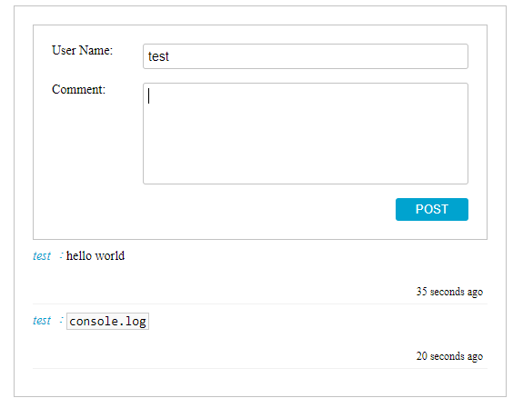

## Table of Content
1. [Description](#appinfo)
2. [Design](#design)
3. [Features](#features)
4. [Installation](#installation)
5. [Reference](#reference)


<a name="appinfo"></a>
## Description
The user can post the comments and the comments are displayed below. The app stores and loads the data from the local Storage. It also displays the time of the comment that has been post.<br>

 <a name="design"></a>
## The file structure
/components folder contains reusable dumb components which only display data.<br>
/containers folder contains smart components which handle the data flow and pass it to the correspond components.<br>
/reducers   folder contains the file that defines the reducers, actions, action types.<br>
<a name="features"></a>
## Techniques
It follows [Container Componenet Presentational Component Architecture ](https://medium.com/@dan_abramov/smart-and-dumb-components-7ca2f9a7c7d0) From Dan Abromov to seperate the components and containers.

It also implements the **ducks Pattern**.

```javascript
// reducer/combineReducers.jsx
import { combineReducers } from 'redux';
import comments from './ducks/comments';

const rootReducer = combineReducers({
    comments
});
export default rootReducer;
```

To change the HTML Tag before convert it into code
```javascript
...
return content
    .replace(/&/g, "&amp;")
    .replace(/</g, "&lt;")
    .replace(/>/g, "&gt;")
    .replace(/"/g, "&quot;")
    .replace(/'/g, "&#039;")
    .replace(/`([\S\s]+?)`/g, '<code>$1</code>')
```

Use Selector to select a subset data from a data collection
```javascript
export const commentSelectors = {
    comments: (state) => state.comments.comments
}
export const selector = createStructuredSelector(commentSelectors)
```
<a name="installation"></a>
## Installation 
It start with <br />
```npx create-react-app comment-app``` <br />
use redux <br />
```npm install redux react-redux``` <br />
use Selector <br />
```npm install reselect``` <br />
<a name="reference"></a>
## Reference
[React.js 小书] http://huziketang.mangojuice.top/books/react/
